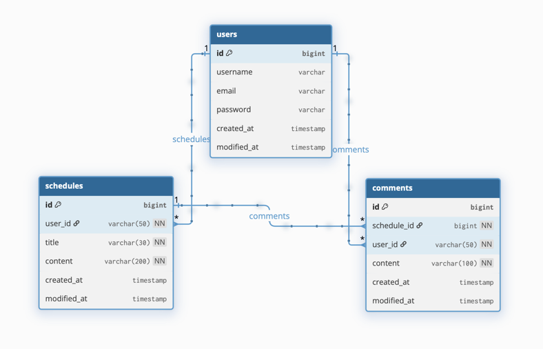

# 📅 Schedule Management API
Spring Boot와 Spring Data JPA를 활용하여
일정을 생성, 조회, 수정, 삭제하는 RESTful API를 구현한 프로젝트

본 프로젝트는 **3-Layer Architecture** 기반으로 설계되었으며,
**JPA Auditing**을 활용하여 작성일/수정일을 자동 관리합니다.

### 📄 API 명세서
https://documenter.getpostman.com/view/50422128/2sBXVeGYKY

### 🗃️ ERD

